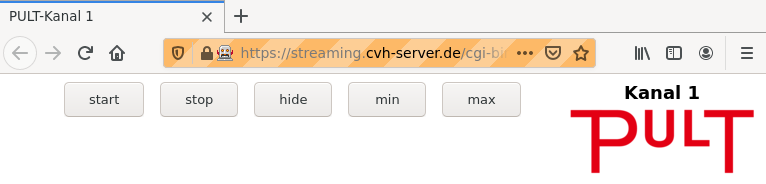
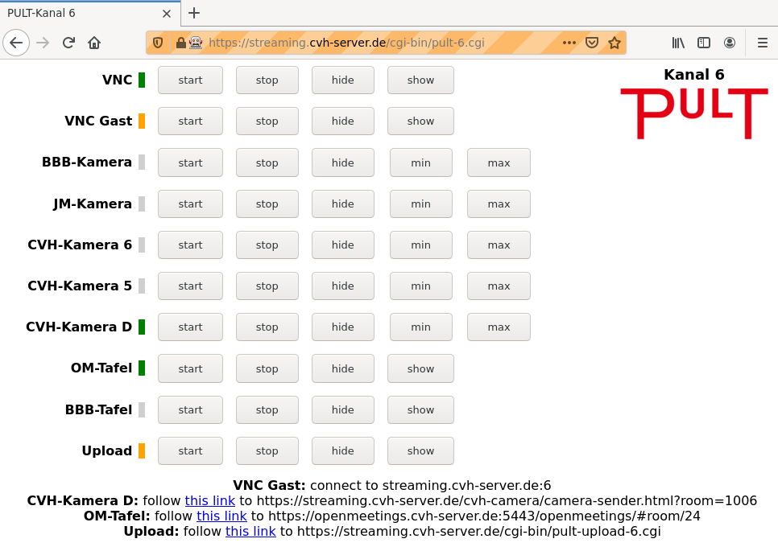
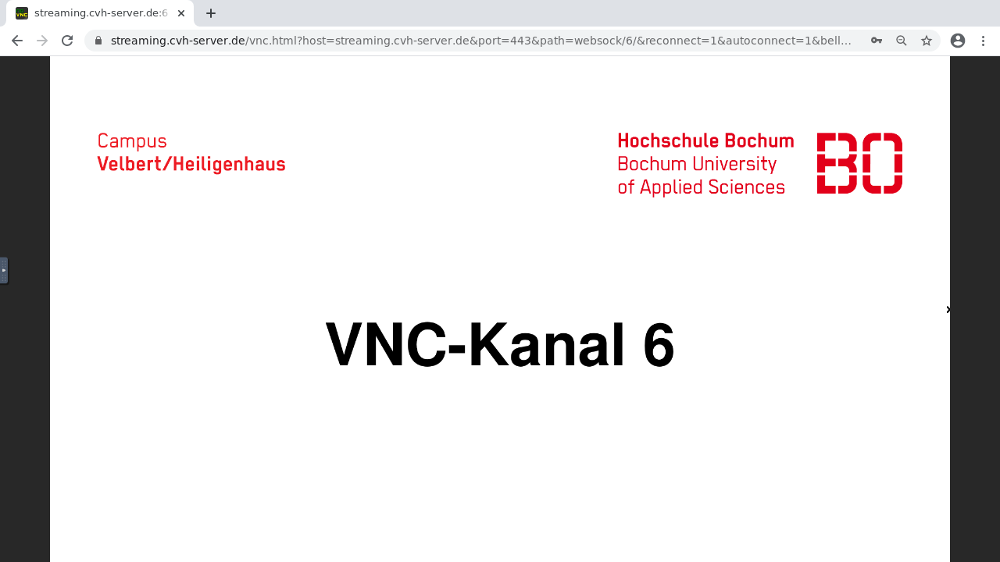
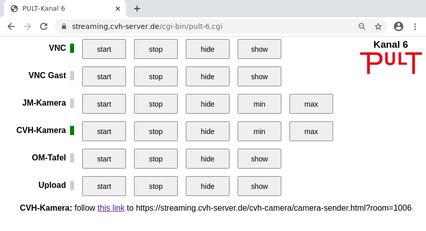
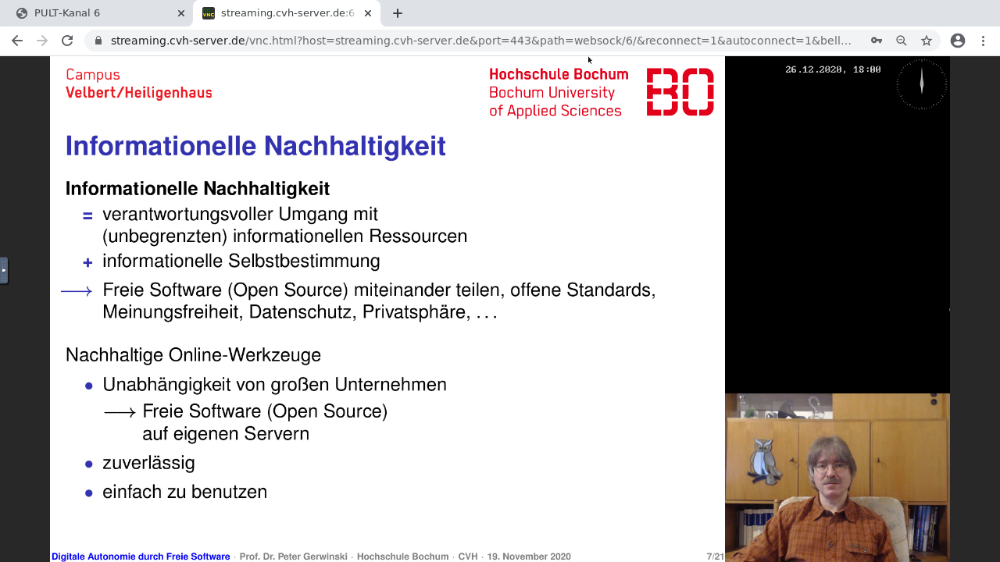
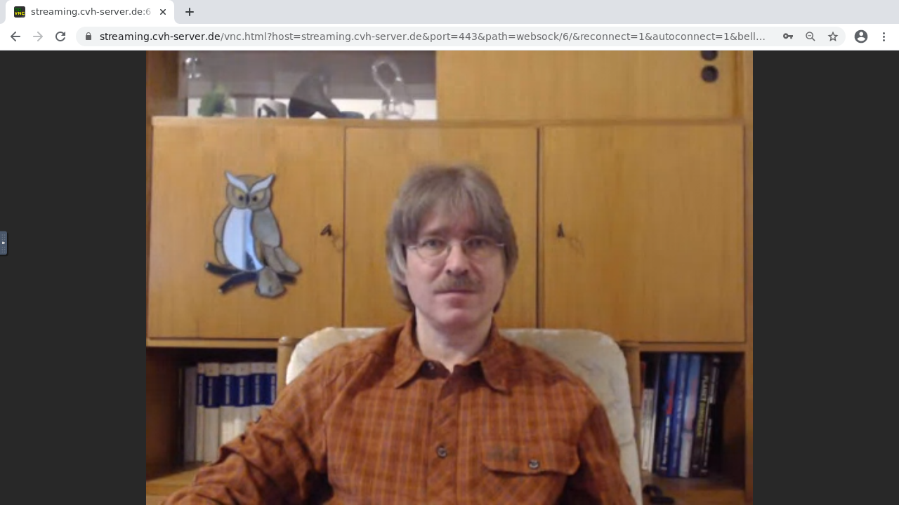
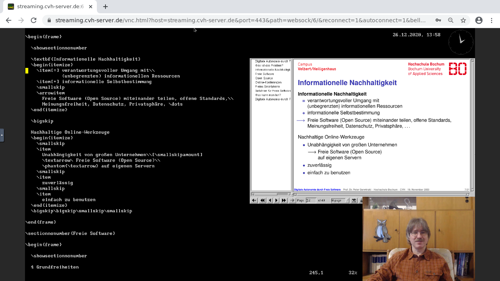
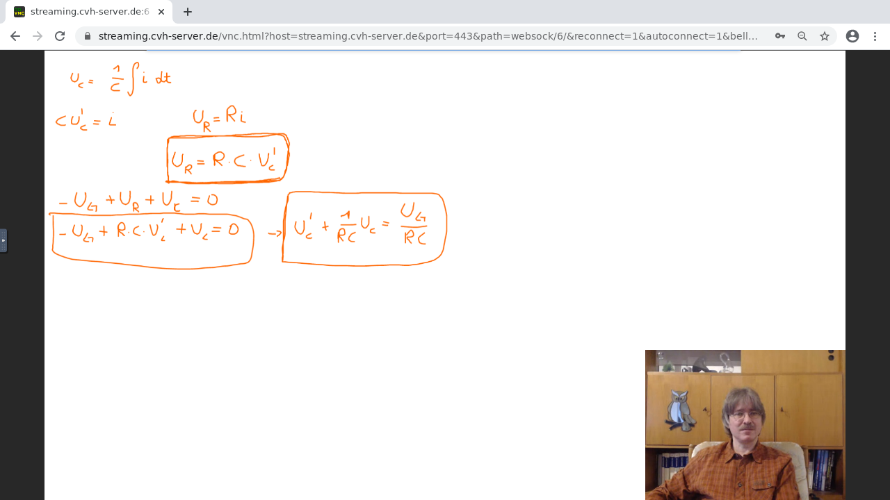
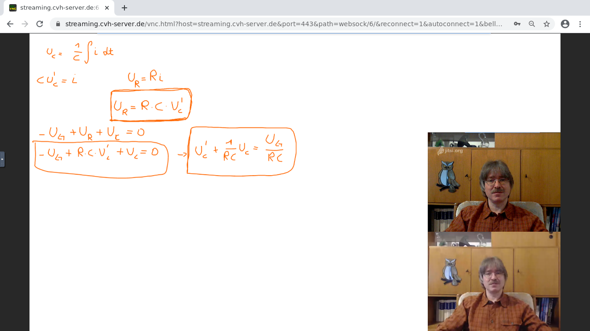

PULT is the ULTimate Learning/Teaching Tool
===========================================

Contents
--------
 * What is PULT?
 * Okay, more technically, what is PULT?
 * How does this look like in practice?
 * License  

Installation: see INSTALL.md (to be written soon)

What is PULT?
-------------
 * **PULT is a video platform for learning and teaching.**

   There are a lot of video systems designed for conferencing,
   which are commonly used for learning and teaching.
   PULT is *designed for* learning and teaching.
   
 * **PULT is simple.**
 
   To participate in a lecture you just go to a web page, type your
   password, and watch.  As a lecturer you have a few buttons to
   control whether something becomes full-screen or whether someone
   may contribute something.  Focus on contents, not on the tool.

 * **PULT is reliable.**

   Even when the network connection isn't the best, you still get
   your lecture through.
   
 * **PULT is 100% Free Software (Open Source).**

   You can run it on your own server for best-possible data
   protection and privacy.  You can study how it works, adapt
   it to your needs, and publish your improvements for everyone
   to benefit.  Also, there are no licensing fees.

 * **PULT husbands your CPU power and network bandwidth.**

   Neither the server nor the client computers need to be high-end.
   PULT can even work when the lecturer's Internet access is rather
   slow.

 * **PULT integrates your favourite platform.**

   We didn't reinvent the wheel. When you like Jitsi Meet and you
   want to use it to show your face to 120 participants, PULT
   makes that possible – in a way which makes it even simpler
   for your participants than if they joined Jitsi Meet.

   When you like the shared whiteboard of OpenMeetings,
   PULT enables you to present it to a big audience,
   where only those who actually write on the whiteboard
   need to join and to understand OpenMeetings.

Okay, more technically, what is PULT?
-------------------------------------
PULT is a collection of small programs, mostly Unix shell scripts.
It provides a console (in German: „Pult“:–) where the lecturer can
select which visual content is offered to the audioence via a web
interface, *noVNC*.  These visual contents can be a shared desktop,
a camera view, an uploaded image or screenshot, or some arbitrary
content provided by some other tool via a web interface, for
instance a BigBlueButton presentation or the shared whiteboard of
OpenMeetings.

PULT itself only handles video.  For the audio part and chat part
it cooperates with Mumble.

The virtual “meeting rooms” in PULT are called *channels*.  For each
channel, there is one instance of noVNC, showing a virtual desktop,
provided by TigerVNC, to the audience.

Each channel is controlled by a deamon, *pultd*, a shell script,
which loads the *modules* configured for this channel, also shell
scripts.  The pultd takes the role of the window manager for the
channel's virtual desktop; the modules are the application software
running on it.

For each channel, the lecturer has a web interface with a row of
buttons for each module to start and stop it, to make it full-screen,
or to take a pre-configured window in the channel.  We intentionally
*don't* let the lecturer drag and drop the window with the mouse.
Pressing a button is by far less distracting.

The audience has, also intentionally, no control over the contents
of the desktop.  They just view their channel via noVNC.  That way
they can concentrate on the learning content rather than on the
viewing tool.

Currently we provide the following modules:

 * **VNC**

   The lecturer can share a destkop content via VNC and/or invite
   participants to share theirs.
   
   VNC provides a pixel-correct transmission of the desktop contents
   at a reasonable speed, using only moderate CPU resources and
   network bandwidth.

   For best performance, we recommand installing a local VNC server.
   For a quick solution, we provide *yesVNC*, a VNC server via a web
   interface.

 * **CVH-Camera**

   The lecturer or a participant can place a camera view in the
   channel.

   One of the videos provided this way can be transmitted via
   the *Janus WebRTC Gateway*.  This allows for a high-quality
   transmission at a moderate, and adjustable, network bandwidth.
   (We are working on making this possible for all camera views.)

 * **Upload**

   The lecturer or a participant can upload an image file or a
   screenshot via a web interface.

 * **BBB-Camera** and **JM-Camera**

   The lecturer or a participant can transmit a camera view via
   BigBlueButton or Jitsi Meet, which then becomes visible in the
   channel.

 * **OM-Board** and **BBB-Board**

   OpenMeetings and BigBlueButton provide shared whiteboards, where
   the lecturer and participants can draw and upload presentations.
   This module makes these boards visible in the channel.

Each channel is easily configurable to meet the needs of the
lecturer.  One lecturer might want as few buttons as possible
(see fig. 1), while another one might prefer to have all modules
enabled, just in case (see fig. 2).

For each configured module, the lecturer's console features a row
of buttons to start and stop the module, and to hide and show its
contents.  Modules can also be configured to get an additional
button to make them run in a pre-defined region of the screen
rather than full-screen.  For camera modules this is the default.
A typical application is to run a VNC shared desktop full-screen
and to show a camera view of the lecturer at the edge. 

> 
>
> Figure 1: A minimalistic PULT console.
>
> VNC is enabled automatically.
> The buttons are for switching a camera.

> 
>
> Figure 2: A PULT console with many features enabled
>
> In this configuration, the lecturer can show 2 different
> shared desktops (“VNC”), 5 different camera views (“Kamera”),
> 2 different shared presentations or boards (“Tafel”), plus
> images or screenshots uploaded by participants (“Upload”).
>
> The green colour indicates that the video source is currently
> active. The yellow colour indicates that it is enabled, but
> currently waiting for a feed.
>
> Below the buttons, the PULT console shows the URLs and other
> types of information how to feed visual data into the system.
> These lines remain visible as long as they are needed.

How does this look like in practice?
------------------------------------
 * Students S1, S2, ... want to take part in a lecture by lecturer L.
   They connect to Mumble for the audio part. For the video part, they
   go to the web page of the channel, type in the channel's password,
   and see a welcome screen.

> 
>
> The welcome screen at the Bochum University of Applied Sciences

 * Lecturer L goes to another specific web page, the PULT console.
   L presses the buttons labeled “VNC start” and “Camera start”.
   L starts the VNC server software and connects to the server.
   L's shared desktop appears in the channel.  L follows a link
   from the PULT console to a separate web page to activate the
   camera.  The camera view becomes visible in the lower right
   corner of the channel.

> 
>
> PULT console with VNC and Camera started

> 
>
> The noVNC screen shows the lecturer's shared desktop in
> full-screen mode and the camera view in the lower right corner.
> The lecturer's desktop features a presentation on the left.

 * For welcoming the students, L presses the button labeled
   “Camera max“.  The camera view becomes full-screen, hiding
   the shared desktop.  After the welcoming, L presses “Camera min”
   to switch back to the previous screen arrangement.

> 
>
> The camera in full-screen view

 * Now L wants to explain a source code. L uses the PULT console
   to switch back from camera full-screen mode to the view of the
   shared desktop with the camera view in the lower right corner.
   L minimises the presentation on the desktop and presents the
   source code.

> 
>
> The same arrangement with the desktop showing a smaller view of
> the presentation on the right and a source code example on the
> left.

 * Student S1 wants to ask a question.  For this purpose, S1 needs
   to upload a screenshot.  L presses the “Upload start”.  The PULT
   console displays a URL.  L forwards this URL to S1 via the Mumble
   chat.  S1 follows the link and presses the “Screenshot” button.
   S1's screenshot appears in the channel, hiding L's desktop, but
   not the camera view.

 * While L answers S1's question, L presses “Upload hide” to switch to
   L's desktop, and later “Upload show” to switch back to S1's uploaded
   screenshot.  When the question is answered, L presses “Upload stop”.
   S1's screenshot vanishes, we are back to the full-screen view of L's
   desktop with a camera view in the corner.

 * L asks the students to present some mathematical calculations.
   S2 volunteers and wants to use the OpenMeeting whiteboard for
   this purpose. L presses “OM board start” on the PULT console.
   S2 logs into OpenMeetings and draws the mathematical calculations
   for everyone to see via noVNC.

> 
>
> A shared OpenMeetings whiteboard presented via noVNC.
> The cameraa view still shows the lecturer.

 * S2 wants to share a camera view as well, using Jitsi Meet.
   L enables the Jitsi Meet camera view via the PULT console.
   S2 logs into Jitsi Meet, and the second camera view appears
   on the noVNC screen.

> 
> 
> A shared OpenMeetings whiteboard presented via noVNC, plus
> two camera views. The upper one was sent via Jitsi Meet.

 * After a while, S3 wants to share a desktop to discuss some results.
   L presses “VNC guest start”.  Since S3 does not have a VNC server
   installed, L copies a URL from the PULT console to S3 in the Mumble
   chat.  S3 follows the URL and presses a button.  S3's desktop is
   presented full-screen in the channel, with L's camera view in the
   corner.  L decides that the camera view hides important parts of
   S3's desktop, and presses “Camera hide”.  The camera view vanishes.
   After the discussion, L presses “VNC Guest stop”.  S3's desktop
   vanishes; L's desktop is visible again.

 * At the end of the lecture, L presses “Camera max” to make the
   camera view full-screen to say goodbye.  L presses “Camera stop”
   and “VNC stop”.  The channel shows a welcome screen again.
   To end the session, everyone closes their browser windows.

License
-------

PULT is Free Software (Open Source) under the
[GNU Affero General Public License (AGPL)](https://www.gnu.org/licenses/agpl-3.0.html),
version 3 or higher, 

In short this means:

 * You are free to run the software, for any purpose.

 * You are free to study how the software works and to adopt it
   to your needs.
   
   To make this possible, you have, as a user of the software,
   the right to obtain its source code, *even if the software
   runs on a server*, and you only connect to that server.
   (This “even on a server” clause is what distinguishes the
   GNU Affero General Public License (AGPL) from the “normal”
   GNU General Public Licnese (GPL).)

 * You are free to distribute copies of this software,
   gratis or for a fee, *provided that* you don't deny
   anyone the rights we gave to you.
   (This “provided that” clause is the *Copyleft*
   principle, an essential feature of the GNU licenses.)
   
 * You are free to improve this software and to publish your
   improvements, so the whole society benefits from it.

   Again, you may do this as a charity service, but you are also
   free to found a business providing this kind of service.
